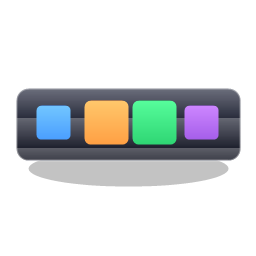

# FloatingDock

Windows 浮动 Dock 托盘 —— 一个轻量、可定制的桌面快捷启动栏。置顶悬浮、拖放添加、一键启动，支持多托盘与 10 套材质主题。



## 功能特性

- **悬浮置顶**：窗口始终置顶，不占用任务栏
- **拖放添加**：拖入 `.lnk` 快捷方式、`.exe` 程序或**文件夹**即可加入托盘
- **一键启动**：点击图标启动程序 / 打开文件夹，右键可定位文件
- **多托盘**：可新建任意多个托盘，独立配置、独立关闭
- **拖拽排序**：按住图标拖动即可调整顺序
- **鱼眼效果**：鼠标悬停时图标放大（macOS Dock 风格）
- **横竖模式**：水平 / 垂直排列，贴靠屏幕左右边缘时自动切换为竖向
- **边缘吸附**：拖动到屏幕边缘自动贴靠（支持多显示器）
- **10 套材质主题**：不是简单换色 —— 渐变 / 顶部光泽 / 多层软阴影 / 新拟态凹凸 / CRT 扫描线纹理
- **外观全可调**：透明度、背景色、圆角/直角、图标大小、标签文字开关、自定义字体、托盘命名
- **开机自启**：注册表方式，仅当前用户
- **配置持久化**：保存于 `%AppData%\FloatingDock\settings.json`，卸载不丢失

## 主题一览

| 主题 | 材质表现 |
|---|---|
| Classic Dark | 哑光深空，纵向渐变 + 微光泽 |
| Glassmorphism | 磨砂玻璃，斜向折射 + 强光泽 |
| Neumorphism | 新拟态，同色系凹凸斜切边框 |
| Fluent | 亚克力层叠 + 发丝边框 |
| Material 3 | 纯色表面 + 4 层海拔阴影 |
| Minimal Light | 云纸白面 + 柔和浮起阴影 |
| Brutalist | 纯黑硬面 + 粗白边框 |
| Retro Pixel | CRT 扫描线纹理 + 像素边框 |
| Aurora | 四色斜向流光 + 发光边框 |
| macOS Dock | 金属三段渐变 + 顶部玻璃反光 |

## 下载安装

前往 [Releases](../../releases) 下载：

- `FloatingDock-Setup-x.y.z.exe` —— **安装包**（图形向导，可自选安装目录，默认 `%LOCALAPPDATA%\Programs\FloatingDock`；无需管理员权限，带开始菜单快捷方式和卸载入口；也支持静默安装 `-Silent -InstallDir "D:\xxx"`）
- `FloatingDock-portable-win-x64.zip` —— **绿色便携版**（解压即用）

系统要求：Windows 10 / 11 x64（自包含 .NET 运行时，无需另装 .NET）。

### 卸载

开始菜单运行 "Uninstall FloatingDock"，或 设置 → 应用 → FloatingDock → 卸载。用户配置保留在 `%AppData%\FloatingDock`，可手动删除。

## 使用方法

| 操作 | 方式 |
|---|---|
| 添加项目 | 拖放 `.lnk` / `.exe` / 文件夹到托盘，或右键 → 添加快捷方式 |
| 启动 | 左键点击图标 |
| 排序 | 按住图标拖动（移动超过 10px 触发） |
| 移动托盘 | 拖动托盘空白处；靠近屏幕边缘自动吸附 |
| 删除项目 | 右键图标 → 移除 |
| 设置 | 右键托盘 → 设置（主题、透明度、大小、字体等） |
| 新建/关闭托盘 | 右键托盘 → 新建托盘 / 关闭此托盘 |
| 退出 | 右键托盘 → 退出 |

## 从源码构建

需要 [.NET SDK 8.0+](https://dotnet.microsoft.com/download)。

```powershell
cd FloatingDock

# 调试运行
dotnet run

# 发布自包含单文件版本
dotnet publish -c Release -r win-x64 --self-contained true `
  -p:PublishSingleFile=true -p:IncludeNativeLibrariesForSelfExtract=true `
  -p:EnableCompressionInSingleFile=true -o publish
```

## 项目结构

```
FloatingDock/
├── App.xaml / App.xaml.cs       # 应用入口
├── DockWindow.xaml(.cs)         # 托盘窗口（拖放/排序/吸附/鱼眼/主题应用）
├── SettingsWindow.xaml(.cs)     # 设置窗口
├── Controls/
│   └── DockItemControl.xaml(.cs)# 单个图标控件（依赖属性驱动外观）
├── Models/
│   ├── DockConfig.cs            # 托盘配置模型
│   ├── DockItem.cs              # 图标项模型
│   ├── AppSettings.cs           # 全局设置模型
│   └── DockTheme.cs             # 主题模型（含材质系统）
└── Services/
    ├── DockManager.cs           # 多托盘生命周期管理
    ├── ThemeService.cs          # 10 套材质主题定义
    ├── ConfigService.cs         # JSON 配置持久化 + 迁移
    ├── IconExtractor.cs         # 图标提取（含文件夹图标）
    └── AutoStartService.cs      # 开机自启（注册表）
```

## 技术栈

- C# / WPF / .NET 8 (`net8.0-windows`)
- 透明无边框窗口（`AllowsTransparency` + `WindowStyle=None`）
- Win32 P/Invoke：多显示器（`MonitorFromWindow`）、Shell 图标提取（`SHGetFileInfo` / `ExtractIconEx`）
- 材质渲染全部为纯 WPF 合成（渐变画刷 / 多层边框阴影 / DrawingBrush 纹理），兼容软件渲染

## License

[MIT](LICENSE) © roseion
